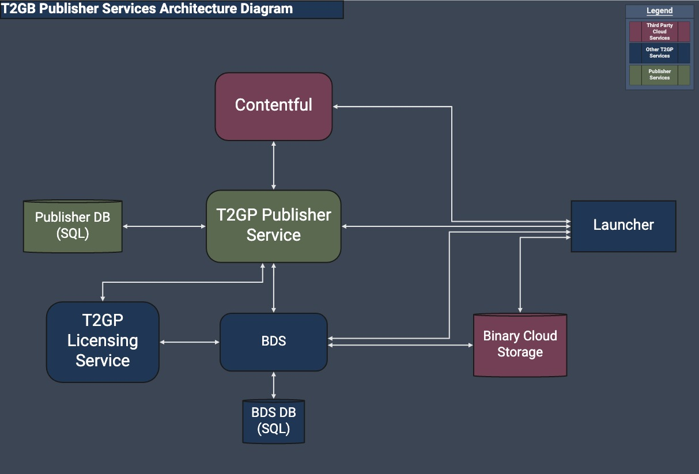

# `t2gp-publisher-service`

> Publisher Service Backend for T2GP publishing platform

## Overview

T2GP Publisher Service is the backend wrapper to glue together BDS, Contentful, and other services (DNA, etc) to support Labels in developing and publishing games.

## Development

### Requirements

- NodeJS (v12+)
  - [nvm](https://github.com/nvm-sh/nvm) simplifies local development and a similar project is available on [Windows](https://github.com/coreybutler/nvm-windows)
  - After istall, you will need to configure access to the `@take-two-t2gp` private registry. Steps are located [here](https://hub.gametools.dev/display/TGP/T2GP+Engineering+Getting+Started)
- [Docker](https://www.docker.com/) & [Docker Compose](https://docs.docker.com/compose/)
  - to run local MariaDB instance

### Environment Configuration

Before starting, populate a `.env` file in the root of the project (this project uses [dotenv](https://www.npmjs.com/package/dotenv) in development, which populates `process.env` with the contents of a `.env` file).

| Name                            | Description                                                                 | Example                  |
| --------------------------------| --------------------------------------------------------------------------- | ------------------------ |
| DATABASE_HOST                   | Database server host                                                        | http://localhost         |
| DATABASE_PORT                   | Database server port                                                        | 3306                     |
| DATABASE_NAME                   | Database name                                                               | `publisher_services_dev` |
| DATABASE_USER                   | Database login name                                                         | `dbuser_1`               |
| DATABASE_PASS                   | Database password                                                           | `hunter2`                |
| DATABASE_DBG (optional)         | Debug SQL queries (verbose)                                                 | `true`, `false`          |
| DATABASE_DROP (optional)        | Dev only, allow db drop                                                     | `true`, `false`          |
| NPM_TOKEN (if building)         | NPM Token to access protected `@take-two-t2gp` modules in Github repository | `abcd1234`               |
| ALLOW_UNAUTHORIZED (optional)   | For development NODE_ENVIRONMENT, disables auth                             | `true`, `false`          |
| BINARY_DISTRIBUTION_SERVICE_URL | URL of the BDS              |  https://dev.bds.api.2kcoretech.online/api/v1.0 |

### Getting Started

Once Node is installed, run the following command in the repository root to install the required packages.

    $ npm i

Build the project by running the build command

    $ npm run build

This should complete and generate output files (`.cjs.js` and others) in `/dist`. Start the Docker container for MariaDB if you haven't already

    $ docker-compose up -d

Run the server with the `dev` command

    $ npm run serve:dev

[VSCODE specific] To debug the app or tests:

- in the "Run and Debug" tab, select the "Open launch.json" button.
- in the opened file use "Add configuration"
- select the "{} Node.js: Launch via npm" preset configuration
- pick a name for it
- in the runtimeArgs change the 2nd param ("debug") to "serve:dev" for debugging the server, "test" for debugging unit tests

### Development shortcuts

If your IDE doesn't support the automated tools, or you prefer the command line, most of the automated tasks (building, linting, and docgen) can be combined via the `concurrently` package.

    $ npm run dev

This will run each script defined in parallel in the same terminal window. Note that for performance reasons, `serve` and `test` are excluded from this parallel task.

## Deployment

> TODO

## Lint

Make sure to use the linter at least before submitting a PR:

    $ npm run lint

[VSCODE specific] Also make sure to install prettier extension and configure it to apply on save; in settings (ctrl+coma, then "Open settings (JSON)" button) add those:
"editor.detectIndentation": false,
"editor.tabSize": 2,
"editor.formatOnSave": true,
"[typescript]": {
"editor.defaultFormatter": "esbenp.prettier-vscode"
},
"files.insertFinalNewline": true,
"files.trimFinalNewlines": true,

## Versioning

> TODO
